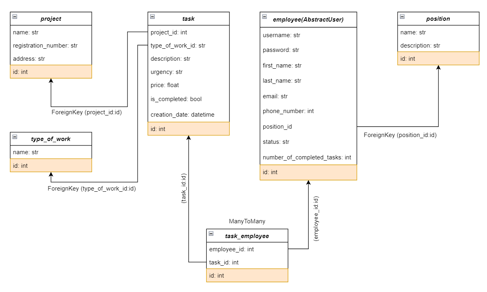
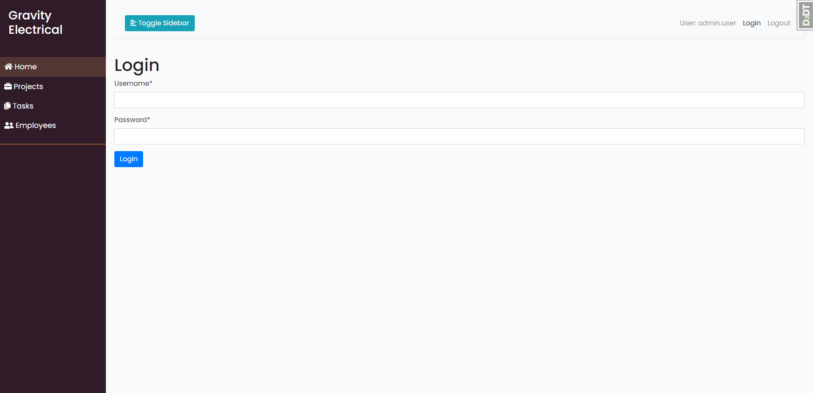
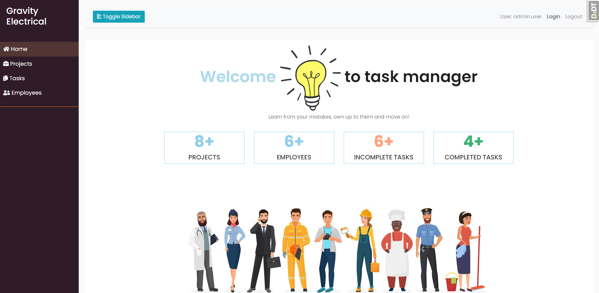
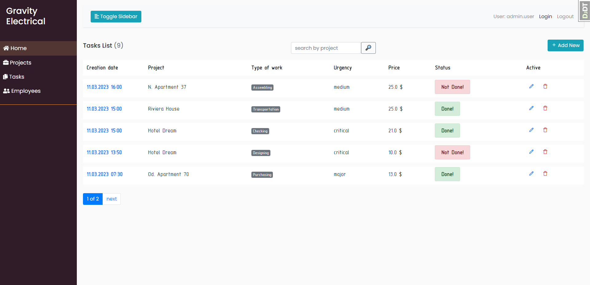
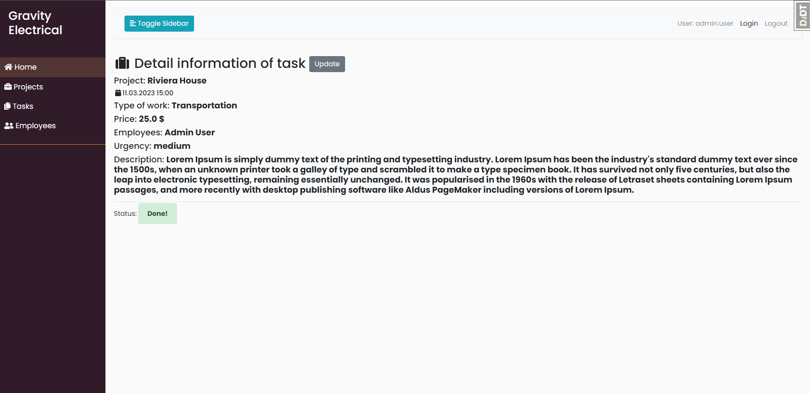
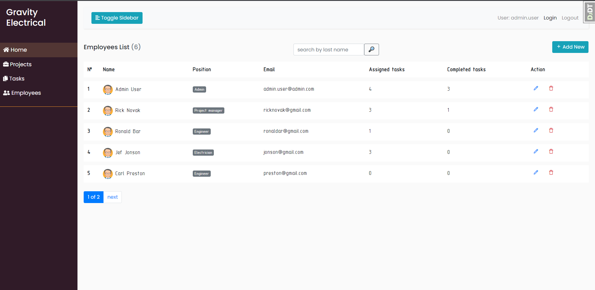
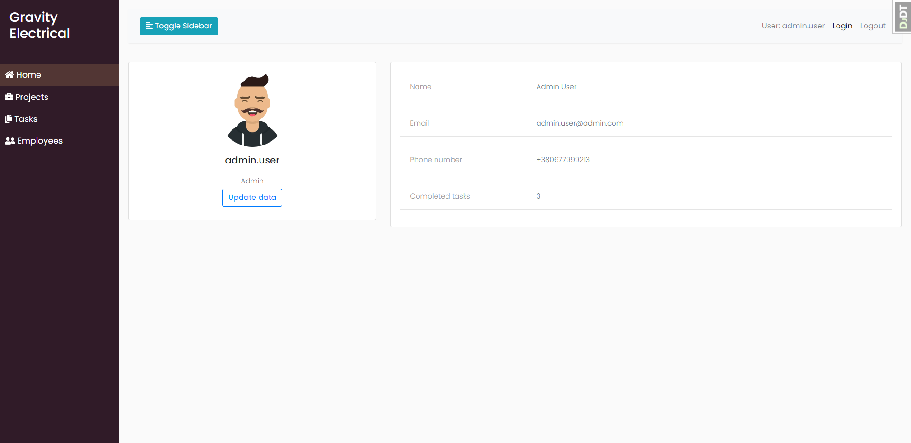

# Construction-company

Task manager for a construction company.
- Use the command to configure the database and tables:
```bash
python manage.py migrate
```
- Use the following command to load prepared data from fixture to test code:
```bash
python manage.py loaddata db_data.json
```

- After loading data from fixture you can use following superuser (or create another one by yourself):
  - Login: `admin.user`
  - Password: `Us2ddTX7`

Feel free to add more data using admin panel, if needed.

**BD structure :**



   **1. Login page :**



   **2. Home page :**



   **3. Task list page :**



   **4. Task detail page :**



   **5. Employees list page :**



   **6. Employyes detail page:**

